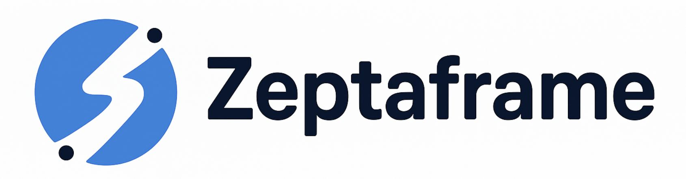
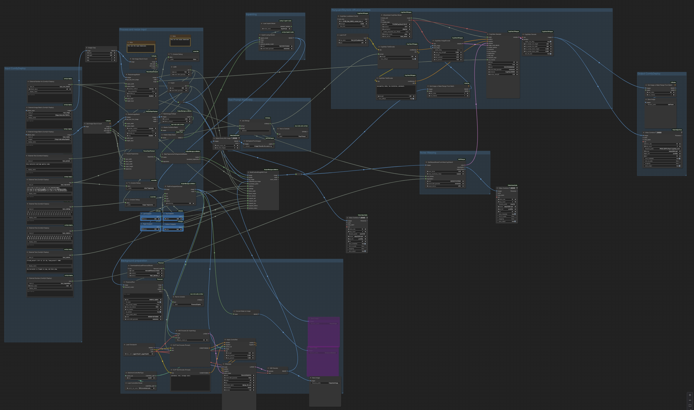

<h1>Zeptaframe</h1>

Zeptaframe is an AI-native video editor that allows you to create precise AI-generated movies with a visual-first approach, minimizing the need for text prompts. It implements the [Go-with-the-flow](https://github.com/Eyeline-Research/Go-with-the-Flow) technique for precise video generation. Try it at CVPR 2025.

This repository only contains the front-end interface. The backend is hosted in cloud GPU instances loaded with ComfyUI, running custom ComfyUI nodes and pipelines.

### Multi Subject Motion Demos 
---

#### Animating a Boxer

#### Animating Horses

### First Frame Editing Demo
---

#### Adding a Dog

### Website

The site is live at https://zeptaframe.com.

## Overview

Zeptaframe is a open-source web-based platform that enables users to create AI-generated videos through an intuitive visual interface. Unlike traditional video editors or AI video generators that rely heavily on text prompts, Zeptaframe allows you to upload images and directly manipulate objects on a canvas to create animations.

## ComfyUI Backend

The backend is hosted in cloud GPU instances loaded with ComfyUI, running custom ComfyUI nodes and pipelines. The respective Go-with-the-Flow LoRA is used in conjuction with either CogVideoX or Skyreels. Wan2.1 support is coming soon.

### Custom ComfyUI Pipeline

## Key Features

### Visual-First Video Creation

* Upload or generate images and animate any object on the canvas
* Segment objects automatically and instantly using the Segment Anything Model (SAM)
* Define object trajectories visually rather than through text descriptions

### Multi-Workbench Environment

* Create complex videos using multiple workbenches (canvases)
* Seamlessly navigate between workbenches
* Each workbench has it own context and controls

### AI-Powered Generation

* Generate videos from your visual compositions
* Multiple quality modes: Flash, Normal, and Ultra
* Support for various video models

### Rich Editing Tools

* Shape creation and manipulation
* Text editing with font customization
* Image import and filtering
* Drawing tools
* Object animation controls
* Camera movement controls

### The bottom panel displays:

* History of generated videos
* Export options
* Video playback controls

## Technical Implementation

### Frontend Framework

* Next.js and React for the UI
* Fabric.js for canvas manipulation

### Backend Services

* NextAuth.js for authentication
* Drizzle ORM for database operations
* Hono for API routes
* Stripe for payment processing

### AI Components

* Segment Anything Model (SAMv2) for object segmentation
* ComfyDeploy for GPU instances loaded with ComfyUI.
* The back-end is using a finetuned version of SkyreelsV1/CogVideoXwith Go-with-the-flow. This allows the model to generate videos of the 
subject traveling as per the users delineation through the interface.

## Notes

This README was generated with Deepwiki from Devin. 

